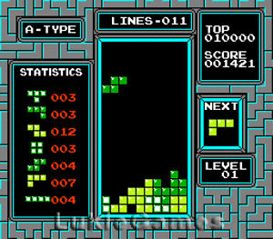
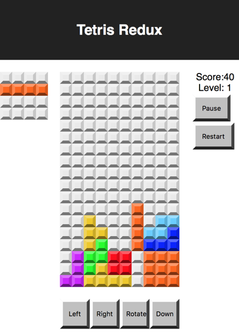

## 🕹️ P00 – Introduction & Project Setup

You're going to build a classic: **Tetris**, using **React** and **Redux**.

This is the classic Tetris game: 


This is what you'll build:  


---

### 🎯 Goal

- Set up a working React project.
- Verify the app runs in your browser.

---

### 🧩 Step 1: Create the React App

Open your terminal and run:

```bash
npx create-react-app tetris-redux
cd tetris-redux
npm start
```

You should see the default React app. From here, we’ll start customizing it.

---

### 🧩 Step 2: Clean the Slate

Replace the contents of `src/App.js` with:

```jsx
function App() {
  return <div>Hello World</div>;
}

export default App;
```

Delete or clean up the following files: 

- `logo.svg`

Delete the contents of `App.css` and `index.css`. You'll fill these in later with App specific styles. 

✅ Your browser should now display just: `Hello World`

---

### 🤖 AI Exploration Prompts

> "What does `create-react-app` set up for you automatically?"

> "What is Tetris? Where did it come from? and how was it originally programmed?"

---

### 🧠 Check for Understanding

- What files are responsible for rendering content to the screen?
- What happens if you delete `index.js`?
