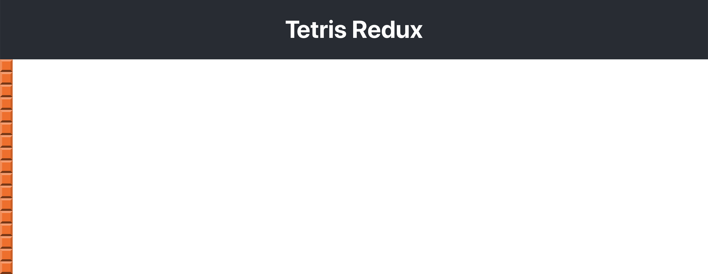
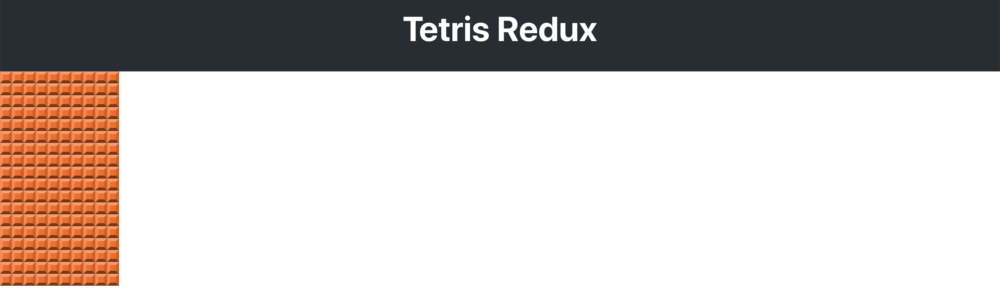

## 🧩 P02 – Grid Board

Now that you have a single grid square, let’s build a full **10×18 Tetris board** using it.

---

### 🎯 Goal

- Create a `GridBoard` component made of 180 `GridSquare`s in a 10 by 18 grid.
- Use CSS Grid to display them in rows and columns.

---

### 🧩 Step 1: Create the GridBoard Component

Create `src/components/GridBoard.js`:

```js
import React from 'react';
import GridSquare from './GridSquare';

// Represents a 10 x 18 grid of grid squares
export default function GridBoard() {
  const grid = [];

  for (let row = 0; row < 18; row++) {
    grid.push([]);
    for (let col = 0; col < 10; col++) {
      grid[row].push(<GridSquare key={`${col}${row}`} color="1" />);
    }
  }

  return <div className="grid-board">{grid}</div>;
}
```

✅ This builds a 2D array of `GridSquare`s using nested loops.

---

### 🧩 Step 2: Display the GridBoard

Update `src/App.js`:

```js
import React from 'react';
import GridBoard from './components/GridBoard';
import './App.css';

function App() {
  return (
    <div className="App">
      <header className="App-header">
        <h1 className="App-title">Tetris Redux</h1>
      </header>
      <GridBoard />
    </div>
  );
}

export default App;
```

✅ You should now see a vertical column of orange squares.



---

### 🧩 Step 3: Add Grid Styles

To arrange the grid correctly, open `src/index.css` and add:

```css
* {
  box-sizing: border-box;
}

.grid-board {
  display: grid;
  grid-template-columns: repeat(var(--cols), var(--tile-size));
  grid-gap: 0;
  align-self: flex-start;
}
```

✔ This uses the `--cols` and `--tile-size` values already defined in `:root`.

Now your orange squares should form a proper **10 by 18 grid**.

---

### 🖼️ Visual Result

You should now see this:



---

### 💬 Try This

- Change `color="1"` in the loop to a random value between 0–7 to simulate a more colorful board.
- Try changing `--tile-size` in `:root` to `30px`.

---

### 🤖 AI Prompts

> "Explain how the nested loop in `GridBoard` builds a 2D array in React."

> "What is the difference between `flex` and `grid` layout in CSS?"

---

### 🧠 Check for Understanding

- Why is each square wrapped with a `key` that combines `col` and `row`?
- What happens if you forget `box-sizing: border-box`?
- How would you render a 5×5 board instead?

---

### 📦 Commit Your Work

```bash
git add .
git commit -m "Added grid board"
git push
```
