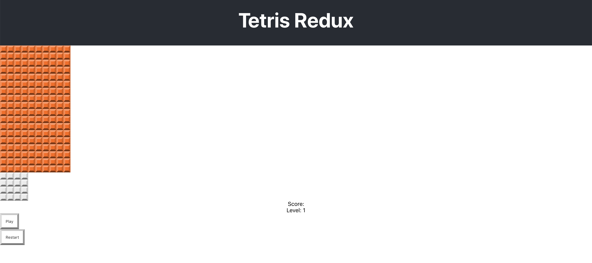

## 🟨 P04 – Score Board

Let’s add a scoreboard to show the player’s **score**, **level**, and include **Play** and **Restart** buttons.

---

### 🎯 Goal

- Create a `ScoreBoard` component with placeholder values.
- Add basic button styles.
- Display it next to the game area.

---

### 🧩 Step 1: Create the Component

Create `src/components/ScoreBoard.js`:

```js
import React from 'react';

export default function ScoreBoard() {
  return (
    <div className="score-board">
      <div>Score: 0</div>
      <div>Level: 1</div>
      <button className="score-board-button" onClick={(e) => {
        // ...
      }}>Play</button>
      <button className="score-board-button" onClick={(e) => {
        // ...
      }}>Restart</button>
    </div>
  );
}
```

✅ No functionality yet — just layout.

---

### 🧩 Step 2: Style the Buttons

Add the following to `src/index.css`:

```css
/* Score Board */
.score-board-button {
  display: block;
  padding: 1em;
  border-width: 5px;
  border-top-color: var(--button-color-t);
  border-left-color: var(--button-color-l);
  border-right-color: var(--button-color-r);
  border-bottom-color: var(--button-color-b);
}
```

This uses your previously defined custom properties for a nice beveled look.

---

### 🧩 Step 3: Add to the App

Update `src/App.js`:

```js
import React from 'react';
import './App.css';

import GridBoard from './components/GridBoard';
import NextBlock from './components/NextBlock';
import ScoreBoard from './components/ScoreBoard';

function App() {
  return (
    <div className="App">
      <header className="App-header">
        <h1 className="App-title">Tetris Redux</h1>
      </header>
      <GridBoard />
      <NextBlock />
      <ScoreBoard />
    </div>
  );
}

export default App;
```

✅ You’ll now see score, level, and two buttons under the Next Block area.

---

### 🖼️ What You Should See

A very basic scoreboard layout:  


---

### 💬 Try This

- Add a temporary `alert()` to the Play or Restart button to test that it works.
- Try changing the score or level text to other values.

---

### 🤖 AI Prompts

> "How could you use `useState` to make the score and level dynamic?"

> "How would you lift state up to share score between components?"

---

### 🧠 Check for Understanding

- Why do we use `onClick={() => {}}` even when the buttons don’t do anything yet?
- What benefit do CSS variables offer for styling buttons and UI elements?

---

### ✅ Commit Your Work

```bash
git add .
git commit -m "Added initial score board"
git push
```
