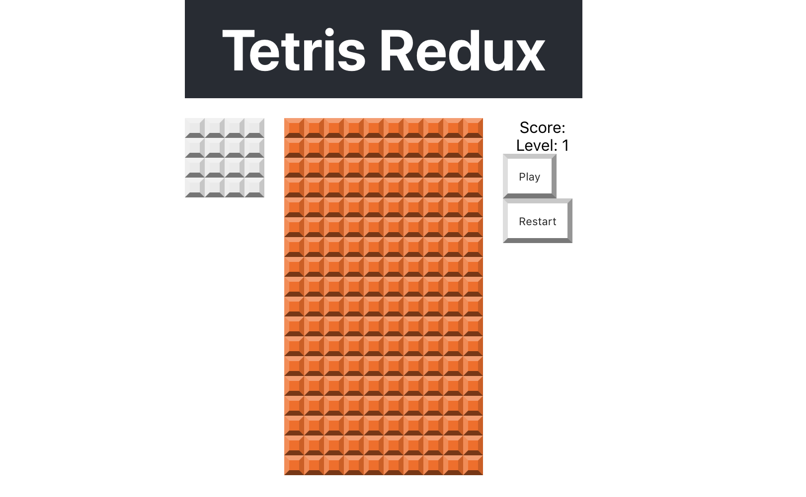

## 🧩 P05 – Arranging the Page

Let’s organize our layout using **CSS Grid** to make the app cleaner and easier to work with.

---

### 🎯 Goal

Use `grid-template-areas` to place components in a 3×3 layout:

```
[ Header              ]
[ Next | Grid | Score ]
[       Buttons       ]
```

---

### 🧩 Step 1: Add Grid Styles to `.App`

Update `src/index.css` with:

```css
/* App */
.App {
  --col-side: calc(var(--tile-size) * 4);
  --col-center: calc(var(--tile-size) * 10);
  --grid-height: calc(var(--tile-size) * 18);

  width: calc(var(--tile-size) * (4 + 1 + 10 + 1 + 4));
  margin: auto;
  display: grid;

  grid-gap: var(--tile-size) var(--tile-size);
  grid-template-columns: var(--col-side) var(--col-center) var(--col-side);
  grid-template-rows: 100px var(--grid-height) 100px;

  grid-template-areas:
    "h h h"
    "l c r"
    ". b .";
}
```

✅ This defines three columns (left, center, right) and three rows (header, content, buttons).

---

### 🧩 Step 2: Assign Areas to Components

Update component styles in `src/index.css`:

```css
/* App-header */
.App-header {
  grid-area: h;
}

/* Next Block */
.next-block {
  grid-area: l;
}

/* Grid Board */
.grid-board {
  grid-area: c;
}

/* Score Board */
.score-board {
  grid-area: r;
}
```

Each component now knows its place on the grid.

---

### 💡 Layout Overview

You just arranged 5 UI elements into this layout:

| Area   | Grid Area |
|--------|-----------|
| Header | `h`       |
| Next   | `l`       |
| Grid   | `c`       |
| Score  | `r`       |
| Buttons (coming later) | `b`   |

You can customize the `.App` layout without touching component code — that's the power of `grid-template-areas`.

---

### 🖼️ What You Should See

A nicely spaced layout like this:  


---

### 💬 Try This

- Temporarily add a background color to `.next-block`, `.grid-board`, or `.score-board` to see layout zones clearly.
- Change `grid-template-columns` to different sizes and observe how the layout shifts.

---

### 🤖 AI Prompts

> "What’s the difference between `grid-template-areas` and manual row/column placement?"

> "How would you use media queries to make this layout responsive?"

---

### 🧠 Check for Understanding

- What’s the benefit of using `grid-area` over flexbox or margins?
- What happens if you assign two elements to the same grid area?

---

### ✅ Commit Your Work

```bash
git add .
git commit -m "Added grid area styles"
git push
```
