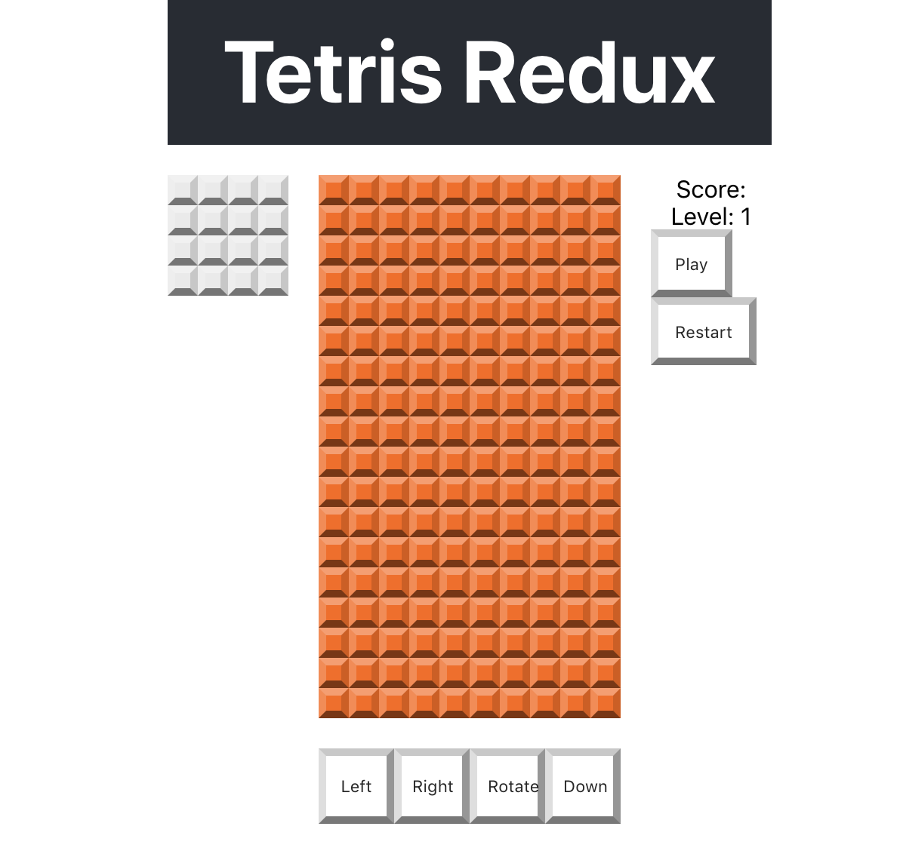

## 🎮 P06 – Controls

Time to add directional controls: **Left**, **Right**, **Rotate**, and **Down** — just like the original game (minus the joystick).

---

### 🎯 Goal

- Create a `Controls` component with four buttons.
- Style the buttons.
- Place the controls in the app layout.

---

### 🧩 Step 1: Build the Component

Create `src/components/Controls.js`:

```js
import React from 'react';

export default function Controls() {
  return (
    <div className="controls">
      <button className="control-button" onClick={() => {}}>Left</button>
      <button className="control-button" onClick={() => {}}>Right</button>
      <button className="control-button" onClick={() => {}}>Rotate</button>
      <button className="control-button" onClick={() => {}}>Down</button>
    </div>
  );
}
```

✅ All buttons are placeholders for now — we’ll hook up the logic later.

---

### 🧩 Step 2: Style the Controls

In `src/index.css`, add:

```css
/* Controls */
.controls {
  grid-area: b;
  display: flex;
  flex-direction: row;
}
```

```css
/* Control Button */
.control-button {
  --size: calc(var(--tile-size) * 2.5);
  width: var(--size);
  height: var(--size);
  text-align: center;
  display: block;
  border-width: 5px;
  border-top-color: var(--button-color-t);
  border-left-color: var(--button-color-l);
  border-right-color: var(--button-color-r);
  border-bottom-color: var(--button-color-b);
}
```

✅ This places the controls in grid area `b` (defined earlier in `App`) and makes them evenly sized buttons using Flexbox.

---

### 🧩 Step 3: Add to App.js

Update `src/App.js`:

```js
import React from 'react';
import './App.css';

import GridBoard from './components/GridBoard';
import NextBlock from './components/NextBlock';
import ScoreBoard from './components/ScoreBoard';
import Controls from './components/Controls';

function App() {
  return (
    <div className="App">
      <header className="App-header">
        <h1 className="App-title">Tetris Redux</h1>
      </header>
      <GridBoard />
      <NextBlock />
      <ScoreBoard />
      <Controls />
    </div>
  );
}

export default App;
```

✅ You should now see four nicely spaced square buttons at the bottom of your layout.

---

### 🖼️ What You Should See

A row of buttons labeled Left, Right, Rotate, Down:  


---

### 💬 Try This

- Add `console.log()` inside each button’s `onClick` to verify they work.
- Temporarily give `.controls` a background color to check layout.

---

### 🤖 AI Prompts

> "What’s the difference between using `flex-direction: row` and `column` in a control bar?"

> "How could you update these buttons to be icons instead of text?"

---

### 🧠 Check for Understanding

- What layout system is being used here — grid or flex?
- Why does each button use `var(--tile-size)` for sizing?
- Why is this component placed in `grid-area: b`?

---

### ✅ Commit Your Work

```bash
git add .
git commit -m "Added initial controls"
git push
```
