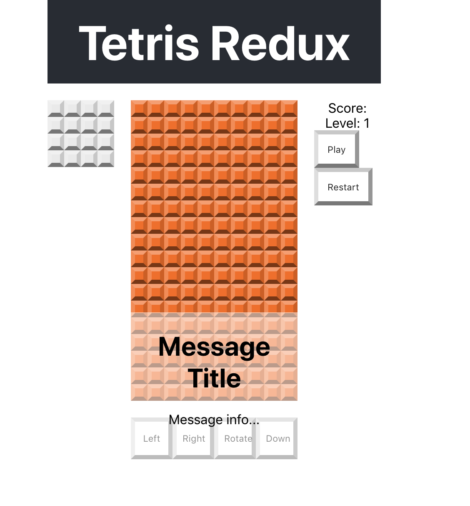

## 💬 P07 – Message Popup

Let’s add a component to display messages like **Paused** and **Game Over** centered over the game.

---

### 🎯 Goal

- Create a `MessagePopup` component.
- Use `position: absolute` to overlay it on the game.
- Hide/show the popup using a `hidden` class.

---

### 🧩 Step 1: Create the Component

Create `src/components/MessagePopup.js`:

```js
import React from 'react';

// Displays a message
export default function MessagePopup() {
  return (
    <div className="message-popup">
      <h1>Message Title</h1>
      <p>Message info...</p>
    </div>
  );
}
```

✅ You’ll style and connect it later — for now, it's just always visible.

---

### 🧩 Step 2: Add Styles

In `src/index.css`, add:

```css
/* Message Popup Styles */
.message-popup {
  position: absolute;
  left: 50%;
  top: 50%;
  transform: translate(-50%, -50%);
  width: calc(var(--tile-size) * 10);
  height: calc(var(--tile-size) * 10);
  background-color: rgba(255, 255, 255, 0.5);
  text-align: center;
}

.message-popup.hidden {
  display: none;
}
```

✅ You can later toggle the `hidden` class dynamically to control visibility.

---

### 🧩 Step 3: Add to App

Update `src/App.js` — add `MessagePopup` at the very bottom of the layout:

```js
import React from 'react';
import './App.css';

import GridBoard from './components/GridBoard';
import NextBlock from './components/NextBlock';
import ScoreBoard from './components/ScoreBoard';
import Controls from './components/Controls';
import MessagePopup from './components/MessagePopup';

function App() {
  return (
    <div className="App">
      <header className="App-header">
        <h1 className="App-title">Tetris Redux</h1>
      </header>
      <GridBoard />
      <NextBlock />
      <ScoreBoard />
      <Controls />
      <MessagePopup />
    </div>
  );
}

export default App;
```

✅ Placing it last ensures it's layered *on top* of the other elements.

---

### 🖼️ What You Should See

A translucent white popup box centered in the middle of the screen:  


---

### 💬 Try This

- Add or remove the `hidden` class manually in the HTML or JS to see it disappear.
- Customize the text in `<h1>` and `<p>` to simulate game states.

---

### 🤖 AI Prompts

> "How could you use Redux or state to conditionally show the message popup?"

> "Why does `transform: translate(-50%, -50%)` perfectly center the box?"

---

### 🧠 Check for Understanding

- Why is `position: absolute` important here?
- What does `.message-popup.hidden` do?
- How is this component different from others that use grid layout?

---

### ✅ Commit Your Work

```bash
git add .
git commit -m "Added initial message popup"
git push
```
