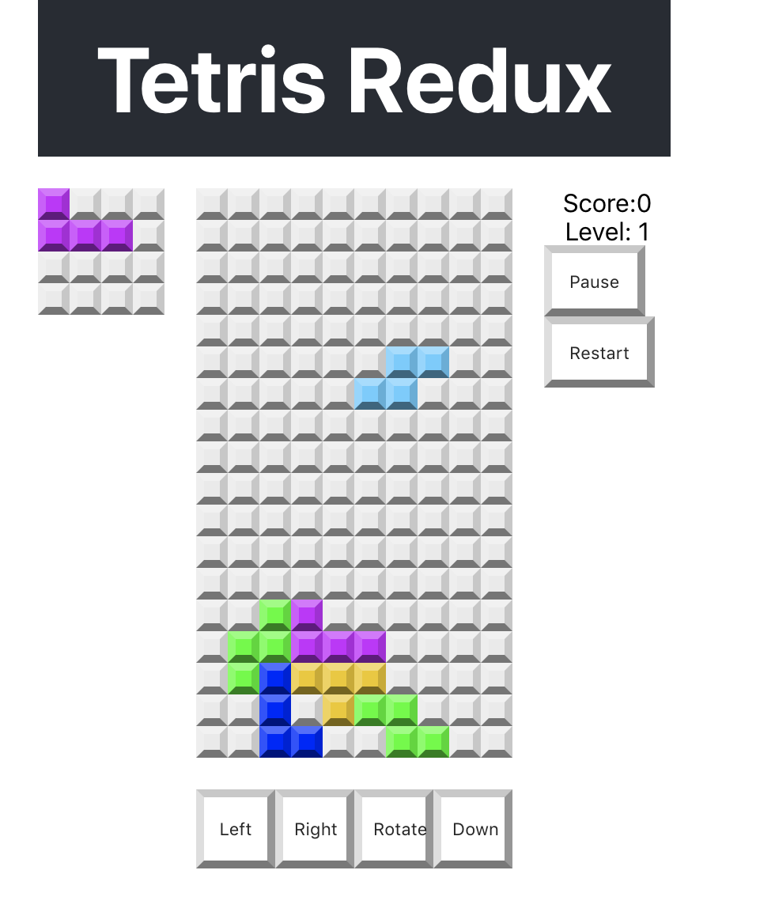

# Moving Down and adding blocks to the grid

1. ~~Implement the overall grid square~~
1. ~~Implement the game board~~
1. ~~Implement the "next block" area~~
1. ~~Implement the score board~~
1. ~~Arrange the layout of the game~~
1. ~~Implement the controls~~
1. ~~Implement the message popup~~
1. ~~Implement the actions and reducers~~
1. ~~Do some code organizing and cleanup~~
1. ~~Implement state and shapes~~
1. ~~Connect each component up to state and reducers~~
1. ~~Implement block rotation~~
1. **Implement moving blocks**
    1. **Implement a method that adds a given block to the game grid for a given x, y, position and rotation**
    1. **Implement a method that looks at the grid and determines if any rows are filled.**
    1. **Build out the moveDown action and reducer**
1. Building a timer system
1. Implementing Game Over and Restart

Moving blocks down serves a few purposes:

1. It moves them down (surprising, right?)
1. It serves as the point where blocks are placed at the bottom of the grid and a new block is added and starts from the top
1. It serves as the point where a block hits an already placed block, and a new block is added and starts from the top
1. If you can't move down without blocks extending off of the top of the grid, it can signal a game over

This is a lot more to think about than with left and right! Let's break down some of the mechanics:

- If a block can't move down it should be added to the grid board array. - This will happen by writing the shape number into grid array at the position of the block.
- If a grid square is empty, the value is 0.
- After placing new squares on the grid we can score points.

You need a function that adds blocks to the grid. 

# Implement an Add block to grid function

This function takes in the `shape` (index), `grid` (array), `rotation`, `x`, and `y`. The values in the new shape that will be written into the grid.

In `/src/utils/index.js`, write the `addBlocktoGrid` function as described above:

```JavaScript
// Adds current shape to grid
export const addBlockToGrid = (shape, grid, x, y, rotation) => {
    // Get the block array
    const block = shapes[shape][rotation];
    // Copy the grid
    const newGrid = [...grid];            
    // Map the Block onto the grid                                                           
    for (let row = 0; row < block.length; row++) {
        for (let col = 0; col < block[row].length; col++) {
            if (block[row][col]) {
                newGrid[row + y][col + x] = shape;
            }
        }
    }
    return newGrid;
}
```

# Scoring points

Teris awards points when a row is completely filled with squares. The number is greater if multiple rows are filled.

Once a block is placed, it's possible that one or more rows will be filled.

In `/src/utils/index.js`, implement a method that looks at the grid and
determines if any rows are filled.

```JavaScript
// Checks for completed rows and scores points
export const checkRows = (grid) => {
  // Points increase for each row completed
  // i.e. 40 points for completing one row, 100 points for two rows
  const points = [0, 40, 100, 300, 1200]
  let completedRows = 0
  for (let row = 0; row < grid.length; row++) {
    // No empty cells means it can't find a 0, so the row must be complete!
    if (grid[row].indexOf(0) === -1) {
      completedRows += 1
      // Remove the row and add a new empty one at the top
      grid.splice(row, 1)
      grid.unshift(Array(10).fill(0))
    }
  }
  return points[completedRows]
}
```

# Implement MOVE_DOWN in game reducer

The `moveDown` action is likely the most complicated
block of code in the game, a lot happens here. Here is what needs to happen:

- Check if block can move the block down
  - if so we're done
- If block can't move down we need to place it by doing the following.
  - add the block to the grid (`addBlockToGrid`)
  - Start a new block
    - set `shape` to `nextShape`
    - set `nextShape` to a new random shape
  - Check if the next shape can be displayed
    - If not, then game over
  - Call `checkRows` to score some points 
  - and remove completed rows

In `/src/features/gameSlice.js`, implement the reducer for `moveDown` based on the above logic. Remember to also import your necessary functions from `utils`, and update what props you're extracting from `state`:

**Challenge**

Import the `addBlockToGrid`, `checkRows`, and `randomShape` from `src/utils` at the top.

-
-
-
-
-
-
-
-
-
-
-
-
-
-
-
-
-
-
-
-
-
-
-
-
-
-
-
-
-
-
-
-
-

```JS
import { 
	defaultState, 
	nextRotation, 
	canMoveTo,
	addBlockToGrid,
	checkRows,
  randomShape
} from '../utils'
```

Find the `moveDown` action and reducer. It should look like this: 

```JS
moveDown: () => {},
```

Replace the empty function with this: 

```JS
...
moveDown: (state) => {
  const { x, y, shape, grid, rotation, nextShape, isRunning, score } = state
  // Get the next potential Y position
  const maybeY = y + 1
  // Check if the current block can move here
  if (canMoveTo(shape, grid, x, maybeY, rotation)) {
      // If so move the block
      state.y = maybeY
      return state
  }
  // If not place the block
  const newGrid = addBlockToGrid(shape, grid, x, y, rotation)
  // reset some things to start a new shape/block
  state.x = 3
  state.y = -4
  state.rotation = 0
  state.grid = newGrid
  state.shape = nextShape
  state.nextShape = randomShape()

  if (!canMoveTo(nextShape, newGrid, 0, 4, 0)) {
    // Game Over
    console.log("Game Should be over...")
    state.shape = 0
    state.gameOver = true
    return state
  }

  // Update the score based on if rows were completed or not
  state.score += checkRows(newGrid)
  return state
},
...
```

At this stage you should be able to move blocks around with the control buttons. They should move left, right, down, and rotate. When a block hits the bottom it should get written into the grid while next block will be added odd the top of the grid.

# Product So Far

Now we can move blocks down in the game, and when they get placed, we can move the next block down as well!



This is great! But we have to manually move the blocks down by clicking the down button. We need the blocks to be able to move down on their own, so let's make that now! We also further covered working with **systems that manage and merge complex arrays!**

# Now Commit

```bash
$ git add .
$ git commit -m 'move down'
$ git push
```
